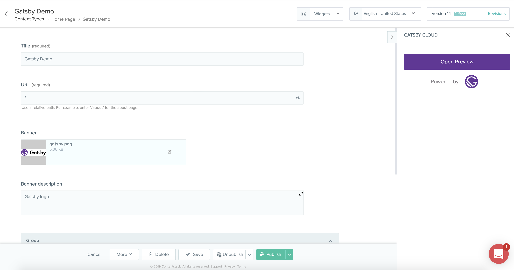

# contentstack-widget-gatsby-cloud

A widget for enabling useful functionality with Contentstack + Gatsby Cloud

## About this extension

Gatsby is an open-source, modern website framework based on React to create and deploy websites or web apps with ease. This UI Extension connects to [Gatsby Cloud](https://www.gatsbyjs.com/preview/) which lets you see updates to your Gatsby site as soon as you change content in Contentstack. This makes it easy for content creators to see changes they make to the website before going live.

**Note:** Gatsby Preview is still in beta, please be mindful when using this extension.

## How to use this extension

Until this is added as a prebuilt template, please do the following: 

`yarn`

`yarn build`

Copy the contents in the `dist` folder and input that in the Extension source code in Contentstack.

Set the `instanceUrl` (required) and `authToken` (optional) in the Config parameters. 

Save the extension and you will be able to add it to your content types as a widget. 

